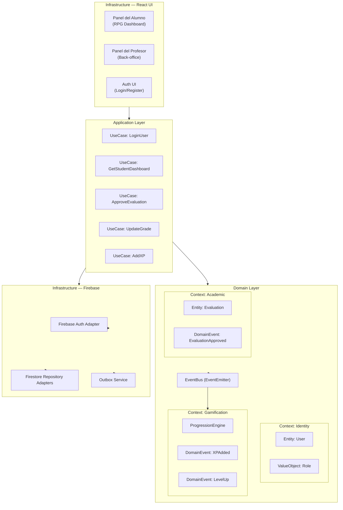
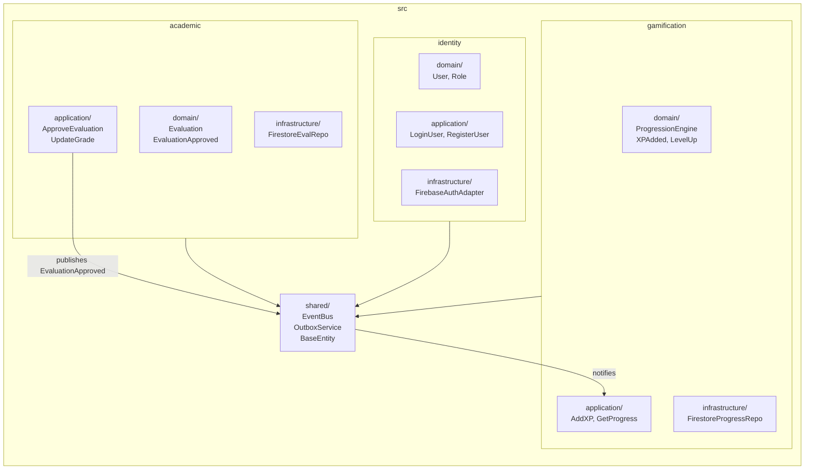
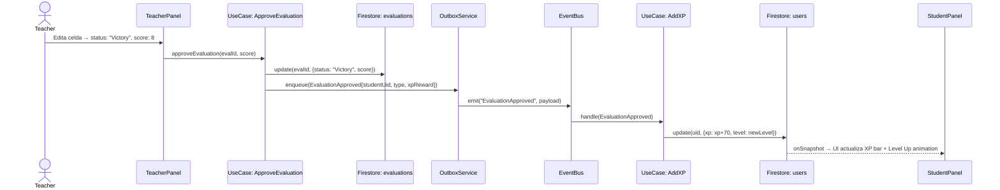
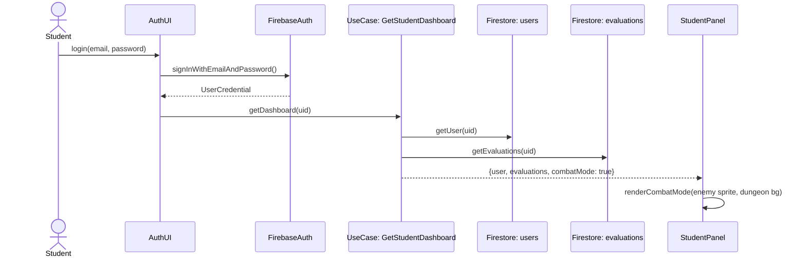
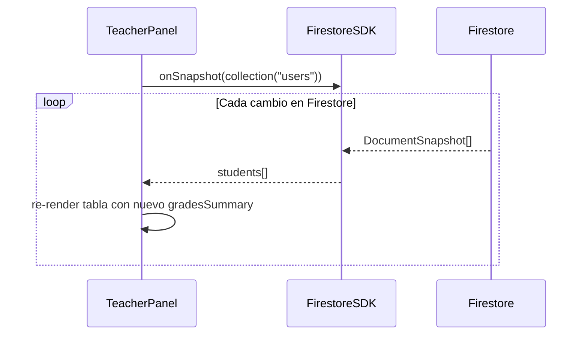

# Design Document: Project-C

## Overview

Project-C es una aplicación web gamificada para la gestión de aula, construida con React + TypeScript + Vite en el frontend y Firebase (Auth, Firestore, Hosting) como backend. Expone dos vistas principales: el **Panel del Alumno** (dashboard estilo RPG "Neo-Pop/Street-Cyberpunk") y el **Panel del Profesor** (back-office de control en tiempo real). La arquitectura sigue un **Monolito Modular con Arquitectura Hexagonal**, dividido en tres contextos acotados: Identity, Gamification y Academic, comunicados de forma asíncrona mediante un EventEmitter interno y el patrón Outbox para garantizar atomicidad.

El motor de progresión convierte las actividades académicas en experiencia (XP) y niveles, y activa un "Modo Combate" dramático en la UI cuando el alumno tiene una evaluación pendiente. El profesor puede editar calificaciones en tiempo real con feedback visual inmediato, y cada aprobación dispara un evento de dominio que actualiza el estado gamificado del alumno.

---

## Architecture

### Diagrama de Capas (Hexagonal)



### Diagrama de Módulos (Monolito Modular)



---

## Sequence Diagrams

### Flujo: Alumno aprueba un TP (Victory)



### Flujo: Alumno entra al Panel (Modo Combate activo)



### Flujo: Profesor observa cambios en tiempo real



---

## Components and Interfaces

### Component: StudentPanel

**Purpose**: Dashboard RPG del alumno. Muestra avatar, nivel, barra de XP, resumen de evaluaciones y activa el Modo Combate si hay un TP pendiente.

**Interface**:
```typescript
interface StudentPanelProps {
  user: StudentUser
  evaluations: Evaluation[]
}

// Modo Combate se deriva del estado de evaluaciones
type CombatMode = boolean // true si existe evaluación con status "Pending"
```

**Responsabilidades**:
- Renderizar avatar con clase (Sword/Axe/Dagger/Bow/Magic) y animación CSS sprite
- Mostrar barra de XP con animación al subir de nivel
- Activar layout "mazmorra" + sprite de enemigo cuando `combatMode === true`
- Disparar animación de victoria (enemigo desaparece, pose de avatar) al recibir `EvaluationApproved`

### Component: TeacherPanel

**Purpose**: Back-office del profesor. Tabla maestra con todos los alumnos, edición de celdas en tiempo real con feedback visual.

**Interface**:
```typescript
interface TeacherPanelProps {
  students: StudentUser[]
  onUpdateGrade: (evalId: string, update: GradeUpdate) => Promise<void>
}

interface GradeUpdate {
  status: EvaluationStatus
  score: number
}
```

**Responsabilidades**:
- Suscribirse a `onSnapshot` de la colección `users` para actualizaciones en tiempo real
- Renderizar tabla editable con celdas de estado (Victory/Defeat/Pending)
- Mostrar indicador "guardando..." durante la escritura en Firestore
- Restringir acceso solo a usuarios con `role: "teacher"`

### Component: XPBar

**Purpose**: Barra de progresión animada que refleja el XP actual del alumno.

**Interface**:
```typescript
interface XPBarProps {
  currentXP: number
  level: number
  xpToNextLevel: number
}
```

### Component: EnemySprite

**Purpose**: Sprite CSS animado del enemigo que aparece en Modo Combate.

**Interface**:
```typescript
interface EnemySpriteProps {
  isDefeated: boolean // true cuando la evaluación pasa a "Victory"
  enemyType: "tp1" | "tp2" | "parcial1" | "parcial2"
}
```

---

## Data Models

### Firestore: `users/{uid}`

```typescript
interface UserDocument {
  displayName: string
  email: string
  role: "student" | "teacher"
  avatarClass: "Sword" | "Axe" | "Dagger" | "Bow" | "Magic"
  level: number          // Math.floor(xp / 100) + 1
  xp: number             // 0 – 960
  xpToNextLevel: number  // (level * 100) - xp
  gradesSummary: {
    [evalKey: string]: {  // e.g. "tp1", "tp2", "parcial1"
      status: "Victory" | "Defeat" | "Pending"
      score: number
    }
  }
}
```

**Reglas de validación**:
- `xp` ∈ [0, 960]
- `level` = `Math.floor(xp / 100) + 1` (derivado, siempre consistente)
- `role` determina permisos de escritura en Firestore Security Rules
- `gradesSummary` es desnormalizado para lecturas rápidas en el panel del profesor

### Firestore: `evaluations/{evalId}`

```typescript
interface EvaluationDocument {
  studentUid: string
  type: "TP" | "Parcial"
  index: number          // 1-based (TP1, TP2, Parcial1, Parcial2)
  status: "Victory" | "Defeat" | "Pending"
  score: number          // 0 – 10
}
```

**Reglas de validación**:
- `score` ∈ [0, 10]
- `status` es la fuente de verdad para el Modo Combate
- Solo `role: "teacher"` puede escribir en esta colección

### Domain Entities (TypeScript)

```typescript
// Identity Context
class User {
  constructor(
    readonly uid: string,
    readonly email: string,
    readonly role: Role,
    readonly avatarClass: AvatarClass
  ) {}
}

type Role = "student" | "teacher"
type AvatarClass = "Sword" | "Axe" | "Dagger" | "Bow" | "Magic"

// Gamification Context
class PlayerProgress {
  constructor(
    readonly uid: string,
    public xp: number,
    public level: number
  ) {}

  addXP(amount: number): LevelUpEvent | null {
    const prevLevel = this.level
    this.xp = Math.min(this.xp + amount, 960)
    this.level = Math.floor(this.xp / 100) + 1
    return this.level > prevLevel ? new LevelUpEvent(this.uid, this.level) : null
  }
}

// Academic Context
class Evaluation {
  constructor(
    readonly id: string,
    readonly studentUid: string,
    readonly type: "TP" | "Parcial",
    readonly index: number,
    public status: EvaluationStatus,
    public score: number
  ) {}

  approve(score: number): EvaluationApprovedEvent {
    this.status = "Victory"
    this.score = score
    return new EvaluationApprovedEvent(this.studentUid, this.type, this.index, score)
  }
}

type EvaluationStatus = "Victory" | "Defeat" | "Pending"
```

### Domain Events

```typescript
class EvaluationApprovedEvent {
  readonly type = "EvaluationApproved"
  readonly xpReward: number

  constructor(
    readonly studentUid: string,
    readonly evalType: "TP" | "Parcial",
    readonly evalIndex: number,
    readonly score: number
  ) {
    this.xpReward = evalType === "TP" ? 70 : 200
  }
}

class LevelUpEvent {
  readonly type = "LevelUp"
  constructor(
    readonly uid: string,
    readonly newLevel: number
  ) {}
}

class XPAddedEvent {
  readonly type = "XPAdded"
  constructor(
    readonly uid: string,
    readonly amount: number,
    readonly newXP: number
  ) {}
}
```

---

## XP Economy & Progression Rules

| Actividad              | XP ganada | Condición                        |
|------------------------|-----------|----------------------------------|
| Clase regular asistida | +20 XP    | Por cada una de las 14 clases    |
| TP aprobado (Victory)  | +70 XP    | Extra al aprobar un TP           |
| Parcial aprobado       | +200 XP   | Extra al aprobar un Parcial      |
| **Máximo total**       | **960 XP**| 14×20 + 2×70 + 2×200 = 960      |

```
Nivel = Math.floor(XP / 100) + 1
Nivel mínimo: 1 (0 XP)
Nivel máximo: 10 (960 XP → Math.floor(960/100)+1 = 10)
```

---

## Error Handling

### Escenario 1: Fallo al escribir en Firestore (ApproveEvaluation)

**Condición**: La actualización de `evaluations/{evalId}` falla por red o permisos.
**Respuesta**: El Outbox Service no encola el evento. La UI muestra error "No se pudo guardar" y revierte el estado optimista de la celda.
**Recuperación**: El profesor puede reintentar la edición. El evento no se emite hasta que la escritura en DB sea exitosa.

### Escenario 2: Evento de dominio perdido (Outbox)

**Condición**: El proceso se interrumpe entre la escritura en DB y la emisión del evento.
**Respuesta**: El Outbox Service persiste los eventos pendientes en Firestore (`outbox/{id}`) con estado `pending`. Un proceso de reconciliación los reintenta al reconectar.
**Recuperación**: Garantía de entrega at-least-once; la lógica de AddXP es idempotente por `evalId`.

### Escenario 3: Acceso no autorizado al Panel del Profesor

**Condición**: Un usuario con `role: "student"` intenta acceder a `/teacher`.
**Respuesta**: El guard de ruta redirige a `/student`. Las Firestore Security Rules bloquean escrituras a nivel de DB.
**Recuperación**: N/A — doble capa de seguridad (UI + Firestore Rules).

### Escenario 4: XP supera el máximo (960)

**Condición**: `addXP()` recibiría un valor que llevaría el XP por encima de 960.
**Respuesta**: `Math.min(xp + amount, 960)` en el dominio. El nivel se recalcula correctamente.
**Recuperación**: N/A — regla de negocio aplicada en la entidad de dominio.

---

## Correctness Properties

*A property is a characteristic or behavior that should hold true across all valid executions of a system — essentially, a formal statement about what the system should do. Properties serve as the bridge between human-readable specifications and machine-verifiable correctness guarantees.*

### Property 1: Invariante de rango XP

*For any* secuencia de llamadas a `addXP(amount)` con `amount ≥ 0`, el valor de `xp` del `PlayerProgress` resultante siempre pertenece al rango [0, 960].

**Validates: Requirements 3.2, 3.3**

---

### Property 2: Consistencia nivel–XP

*For any* valor de `xp` ∈ [0, 960], el `level` calculado por el `Progression_Engine` es siempre `Math.floor(xp / 100) + 1`, lo que garantiza que `level` ∈ [1, 10].

**Validates: Requirements 3.1, 3.4, 8.3**

---

### Property 3: XP correcto por tipo de actividad

*For any* alumno con XP inicial `x` ∈ [0, 960], aprobar un TP incrementa el XP en exactamente 70 (sujeto al cap de 960), aprobar un Parcial lo incrementa en exactamente 200, y registrar asistencia lo incrementa en exactamente 20.

**Validates: Requirements 3.5, 3.6, 3.7**

---

### Property 4: Idempotencia del handler AddXP (Outbox)

*For any* evento `EvaluationApproved` con un `evalId` dado, procesar ese evento N veces (N ≥ 1) produce exactamente el mismo estado final de XP que procesarlo una sola vez.

**Validates: Requirements 4.6, 11.4**

---

### Property 5: Combat_Mode equivale a evaluaciones Pending

*For any* lista de evaluaciones de un alumno, el valor de `combatMode` derivado por el `Student_Panel` es `true` si y solo si existe al menos una evaluación con `status === "Pending"`.

**Validates: Requirements 6.1, 6.5**

---

### Property 6: Renderizado completo del Teacher_Panel

*For any* lista de alumnos con sus `gradesSummary`, el `Teacher_Panel` renderizado incluye para cada alumno: nombre, nivel, XP y el estado y puntaje de cada evaluación (TP1, TP2, Parcial1, Parcial2).

**Validates: Requirements 7.5**

---

### Property 7: Persistencia de eventos Outbox

*For any* evento de dominio encolado por el `Outbox_Service`, el evento aparece en la colección `outbox/{id}` de Firestore con estado `pending` antes de ser procesado, y con estado `processed` tras ser procesado exitosamente.

**Validates: Requirements 11.1, 11.2**

---

### Property 8: Recuperación de eventos pending al reconectar

*For any* conjunto de eventos con estado `pending` en la colección `outbox`, al reconectar la aplicación el `Outbox_Service` recupera y reemite todos esos eventos.

**Validates: Requirements 4.5, 11.3**

---

### Property 9: Control de acceso universal (Route Guard)

*For any* ruta protegida de la aplicación, un usuario no autenticado es siempre redirigido a la pantalla de login sin acceder al contenido de la ruta.

**Validates: Requirements 1.3**

---

### Property 10: Restricción de escritura en Firestore por rol

*For any* usuario con `role !== "teacher"`, cualquier intento de escritura en las colecciones `evaluations` o `users` es rechazado por las `Firestore_Security_Rules`.

**Validates: Requirements 2.3, 2.5**

---

## Testing Strategy

### Unit Testing

- **ProgressionEngine**: Verificar que `addXP()` calcula nivel correctamente para todos los rangos de XP (0, 99, 100, 959, 960, overflow).
- **Evaluation.approve()**: Verificar que emite `EvaluationApprovedEvent` con `xpReward` correcto según tipo (TP=70, Parcial=200).
- **EventBus**: Verificar que los suscriptores reciben los eventos correctos.
- **Combat_Mode derivation**: Verificar que `combatMode` es `true` con al menos una evaluación Pending y `false` sin ninguna.

### Property-Based Testing

**Librería**: `fast-check`

- **Property 1**: Para cualquier XP ∈ [0, 960] y cualquier `amount ≥ 0`, `addXP(amount)` nunca produce `xp > 960`.
- **Property 2**: Para cualquier `xp` ∈ [0, 960], `level = Math.floor(xp / 100) + 1` ∈ [1, 10].
- **Property 3**: Para cualquier tipo de actividad (TP/Parcial/Asistencia), el XP sumado es exactamente el valor de la tabla de economía (sujeto al cap).
- **Property 4**: Aprobar la misma evaluación N veces produce el mismo XP final que aprobarla una vez (idempotencia).
- **Property 5**: `combatMode === evaluations.some(e => e.status === "Pending")` para cualquier lista de evaluaciones.
- **Property 10**: Para cualquier usuario con `role !== "teacher"`, la escritura en `evaluations` es rechazada.

### Integration Testing

- **ApproveEvaluation → AddXP**: Verificar el flujo completo desde la aprobación hasta la actualización de XP en Firestore (usando Firebase Emulator Suite).
- **onSnapshot en TeacherPanel**: Verificar que la tabla se actualiza al modificar un documento en Firestore.
- **Outbox recovery**: Verificar que eventos `pending` son reemitidos al reconectar.

---

## Mobile-First Design

La app es **mobile-first**. El layout se diseña primero para pantallas pequeñas (≥320px) y se escala hacia arriba con media queries.

### Breakpoints

| Breakpoint | Ancho mínimo | Contexto              |
|------------|--------------|-----------------------|
| `sm`       | 320px        | Base (mobile)         |
| `md`       | 768px        | Tablet                |
| `lg`       | 1024px       | Desktop               |

### Panel del Alumno (mobile)

- Layout de una columna: avatar centrado arriba, barra de XP debajo, evaluaciones en cards apiladas
- El avatar sobresale del contenedor con `position: absolute` ajustado para no romper el flujo en pantallas pequeñas
- Modo Combate: el sprite del enemigo ocupa el ancho completo de la pantalla en mobile
- Tipografía escalada con `clamp()` para mantener legibilidad en cualquier tamaño

### Panel del Profesor (mobile)

- La tabla maestra usa scroll horizontal (`overflow-x: auto`) en mobile
- En pantallas pequeñas, las columnas menos críticas se ocultan con `display: none` y se muestran en tablet/desktop
- Las celdas editables tienen área de toque mínima de 44×44px (recomendación de accesibilidad táctil)

### Consideraciones generales

- Usar `rem` y `%` en lugar de `px` fijos para tamaños y espaciados
- Imágenes y sprites optimizados para pantallas retina (`image-rendering: pixelated` para sprites 2D)
- Touch events nativos del browser para interacciones táctiles (sin librerías extra)

---

## Performance Considerations

- **onSnapshot acotado**: La suscripción del profesor se limita a la colección `users` con filtro por `role: "student"` para evitar leer documentos de profesores.
- **Desnormalización de `gradesSummary`**: Evita joins en el panel del profesor; el costo es mantener consistencia entre `evaluations` y `users.gradesSummary` (responsabilidad del caso de uso `ApproveEvaluation`).
- **Animaciones CSS**: Se usan `steps()` y `transform` para animaciones de sprites, evitando reflows. `canvas-confetti` se carga de forma lazy solo cuando se dispara el evento de victoria.
- **Code splitting**: Cada panel (Student/Teacher) se carga con `React.lazy()` para reducir el bundle inicial.

---

## Security Considerations

- **Firestore Security Rules**: Solo `role: "teacher"` puede escribir en `evaluations` y `users`. Los alumnos solo pueden leer su propio documento (`request.auth.uid == resource.data.studentUid`).
- **Firebase Auth**: Toda la app requiere autenticación. El `role` se almacena en el documento del usuario y se verifica en las Rules (no en el token JWT para evitar stale data).
- **Route Guards**: Guards de React Router verifican el rol antes de renderizar cada panel.
- **Outbox idempotencia**: Cada evento del Outbox tiene un `evalId` único; el handler de `AddXP` verifica si el evento ya fue procesado antes de sumar XP.

---

## Dependencies

| Dependencia         | Versión  | Propósito                                      |
|---------------------|----------|------------------------------------------------|
| react               | ^18      | UI framework                                   |
| typescript          | ^5       | Tipado estático                                |
| vite                | ^5       | Build tool y dev server                        |
| firebase            | ^10      | Auth, Firestore, Hosting                       |
| react-router-dom    | ^6       | Routing y route guards                         |
| canvas-confetti     | ^1       | Efecto de confetti en victorias                |
| animate.css         | ^4       | Animaciones CSS predefinidas                   |
| fast-check          | ^3       | Property-based testing                         |
| vitest              | ^1       | Test runner                                    |
| firebase-tools      | latest   | Deploy a Firebase Hosting (dev dependency)     |
